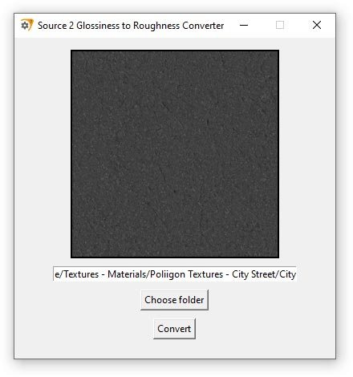

# Glossiness to Roughness Converter



## Overview

The Glossiness to Roughness Converter is a simple application designed to convert glossiness texture maps to roughness 
maps. This is particularly useful for Source 2 game developers.

## Features

- Drag-and-drop interface for easy texture loading.
- Automatic conversion from glossiness to roughness.
- Customizable output directory and file naming.
- Very simple UI.

## How to Use

1. **Drag and Drop**: Simply drag your glossiness texture file into the application window.
2. **Conversion**: The application automatically converts the glossiness map to a roughness map.
3. **Save**: The converted file is saved in the specified directory with a "_rough" suffix.

## Compilation Instructions for Windows

Since PyInstaller does not support cross-platform compilation, you will need to compile the application on a Windows machine. Follow these steps to compile the program:

### Prerequisites

- **Python 3.11**: Ensure Python is installed on your system.
- **Pip**: Make sure you have pip installed to manage Python packages.

### Installation

1. **Clone the Repository**: Clone this repository to your local machine.

   ```bash
   git clone https://github.com/yourusername/your-repo.git
   cd your-repo
   ```

2. **Install Dependencies**: Install the required Python packages using the provided `requirements.txt` file.

   ```bash
   pip install -r requirements.txt
   ```

3. **Install PyInstaller**: You need PyInstaller to compile the application.

   ```bash
   pip install pyinstaller
   ```

### Compilation

To compile the application into a standalone executable, use the following command:

```bash
pyinstaller main.spec
```

This command will generate an executable in the `dist` directory.

### Running the Application

Navigate to the `dist` directory and run the generated executable. The application will launch and be ready for use.

## License

This project is licensed under the MIT License. See the [LICENSE](LICENSE) file for details.

## Contributing

Contributions are welcome! Please fork the repository and submit a pull request for any improvements or bug fixes.
